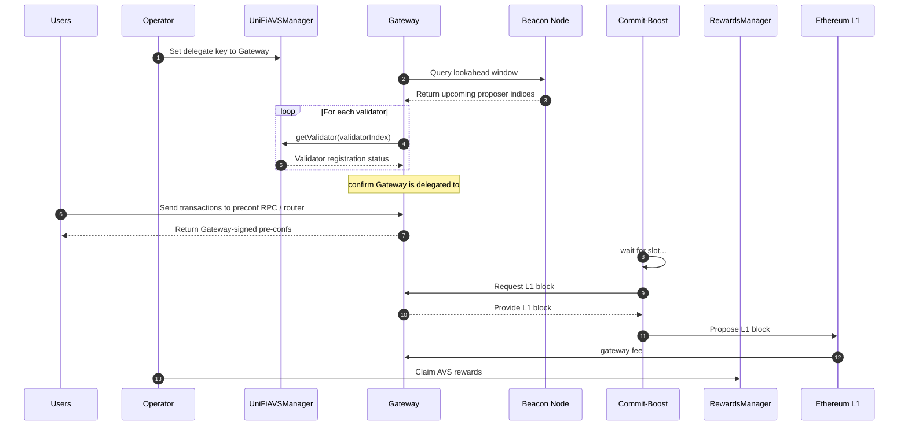

# Overview
UniFi AVS is composed of off-chain software for handling pre-conf operations, and on-chain contracts for handling registrations, rewards, and punishments.

The following diagram highlights how these components interact with each other:
> 

## Preconf Flow

The preconf flow in UniFi AVS involves several steps and interactions between different components of the system. The following sequence diagram illustrates this process:

Here's a detailed description of the preconf flow:

0. **Registration (Not Shown)**: 
    - The `Operator` is assumed to already be [registered](registration.md#operator-registration-process) to the UniFi AVS.

1) **Delegate Key Setup**: 
   - The operator sets their delegate key to point to a Gateway. This allows the Gateway to act on behalf of the operator for preconfirmation duties.

2. **Lookahead Window Request**:
   - The Gateway queries their Beacon node to check the lookahead window 
   
3. **Lookahead Window Response**:
    - The Gateway learns the validator indices of the upcoming proposers.

4. **getValidator call**:
   - For each validator index received, the Gateway queries the UniFiAVSManager contract using the `getValidator` function.

5. **getValidator response**:
   - The contract returns information if the validator is registered on the AVS. The Gateway can confirm that the validator has delegated to them via the `delegateKey` field.

6. **User Transactions**:
   - Users can begin sending transactions to the Gateway via the Gateway's RPC or a Router. 
   
7. **Gateway Response**:
   - The Gateway signs preconfs with their delegate key and returns the signatures to the Users.

8. **Validator Operations**:
    - The validator's Commit-Boost client will wait until the block proposal slot.

9. **L1 Block Request**:
   - When it's time to propose a block, the validator (via Commit-Boost) requests the final L1 block from the Gateway.
   
10. **L1 Block Response**:
   - The Gateway returns an L1 block containing the pre-conf'd transactions.

11. **L1 Block Proposal**:
   - The validator broadcasts the L1 block to the rest of the validators, adding it to the L1 state.

12. **Gateway Reward**:
    - A flat fee is awarded to the Gateway for their coordination services.

13. **AVS Reward**:
    - The rest of the block rewards are deposited into the `RewardsManager` contract. Here the RewardsManager smooths out the rewards from the participating validators, ensuring a more consistent distribution over time.

## Node Software
The following diagram highlights system's main software components:
> 

UniFi AVS has a tight coupling with Commit-Boost, allowing validators to seamlessly participate in the preconfirmation process while maintaining their regular validation duties. Validators will run Commit-Boost alongside their standard validator stack. When they are ready to propose a block, they have the flexibility to choose how they want to handle their preconfirmation responsibilities. Options include:

1. Self-build: The validator can use Commit-Boost to directly handle their preconfirmation responsibilities.
2. Delegate: The validator can use Commit-Boost to delegate their preconfirmation duties to another entity e.g., a sophisticated Gateway.

## Smart Contracts
### `UniFiAVSManager` - AVS Registrations
#### Operator Registration
At a high level it is required for an `Operator` within the EigenLayer contracts to opt-in to the AVS. See the [Operator Registration Process](registration.md#operator-registration-process) section for more details.

#### Delegate Key Registration
Each `Operator` will register a single `delegateKey` that will be used to issue preconfs. See the [Delegate Key Registration](registration.md#delegate-key-registration) section for more details.

#### Validator Registration
If an EigenPod owner has delegated their stake to an `Operator`, then the `Operator` can register the EigenPod's validators as preconferers in the AVS. See the [Validator Registration](registration.md#validator-registration) section for more details.

> **Aside on Neutrality**: In the spirit of neutrality, it is important to keep preconf registrations credibly neutral. As such, the Ethereum community is working to launch a permissionless registry contract that exists outside of any protocols (i.e., outside of Puffer or EigenLayer). To prevent fragmentation, the `UniFiAVSManager` contract will look to this registry as a primary source when validators register, and revert if the validator is not opted-in.

### `RewardsManager` - Rewards Distribution

The rewards distribution in UniFi AVS is designed to provide a consistent and attractive incentive structure for participating validators. Key features of the rewards system include:

1. preconf fees
2. MEV-smoothing mechanism
3. Ether-only payouts
4. Competitive earnings potential

For a comprehensive overview of the rewards distribution system, including its key features, benefits, and impact on the Ethereum ecosystem, see the [Rewards Distribution](rewards.md) document.

### `DisputeManager` - Slashing
UniFi AVS implements slashing to ensure the integrity of the preconfirmation process. This mechanism is designed to penalize validators who break their preconfirmation promises or fail to fulfill their duties.

The slashing mechanism consists of two main components:

1. Safety Faults: Penalties for breaking preconfirmation promises.
2. Liveness Faults: Penalties for missing block proposals.
3. Rewards Stealing: Penalties for 'Rug-Pooling'.

For a detailed explanation of the slashing mechanism, including the types of faults, the slashing process, and future developments, please refer to the [Slashing Mechanism](slashing.md) document.

