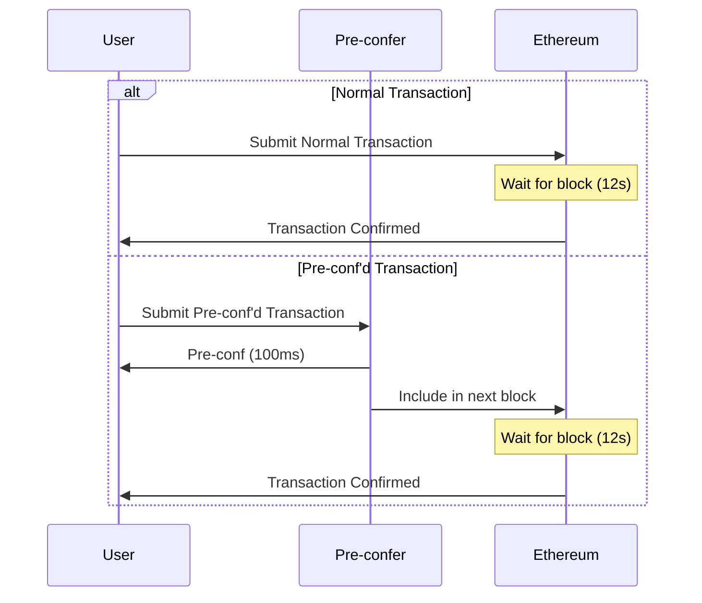
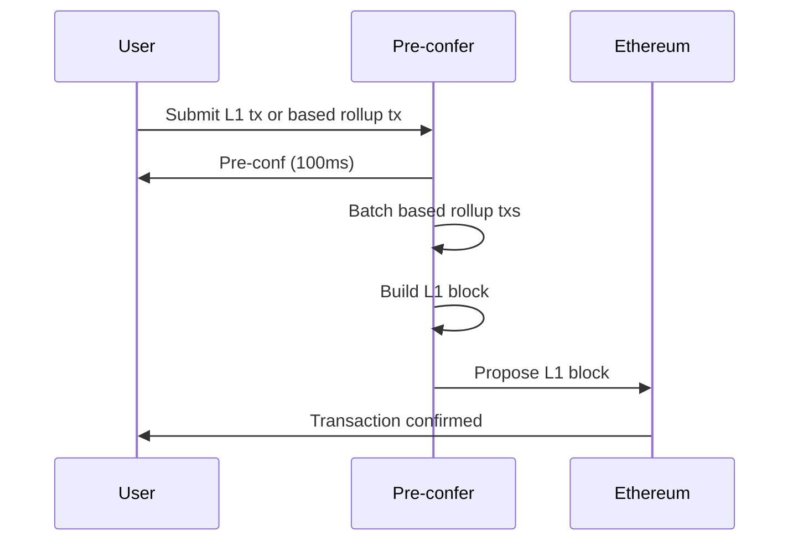
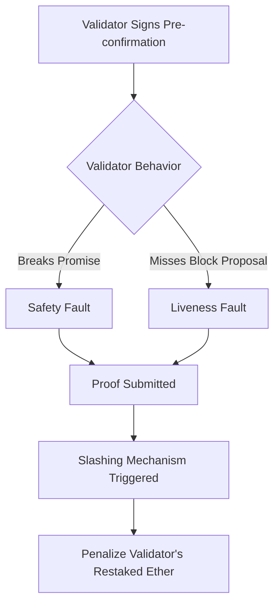

# UniFi AVS

## TL;DR
UniFi AVS is an EigenLayer-based solution addressing challenges in Ethereum's pre-confirmation (pre-conf) ecosystem. It offers permissionless validator participation, on-chain registry, and slashing mechanisms for accountability. Built on EigenLayer and integrating Commit-Boost, UniFi AVS aims to provide fast, secure, and neutral pre-confirmations for based rollups, enhancing Ethereum's scalability while maintaining its core principles.

## Introduction
UniFi AVS is an EigenLayer AVS (Actively Validated Service) designed for based pre-confirmations (pre-confs) in the Ethereum ecosystem. This document outlines the context, problem statement, and details of the  UniFi AVS.

## Background

### EigenLayer
EigenLayer is a protocol that allows Ethereum validators to restake their ETH and provide security to other applications or services. This restaking mechanism enables validators to earn additional rewards by participating in multiple networks or services simultaneously. Leveraging EigenLayer allows for out-of-protocol modifications to Etheruem's stack without requiring a hardfork, which enables new infrastructure like proposer commitments.

### Proposer Commitments
Proposer commitments are a mechanism in Ethereum where validators can make specific promises about their behavior when proposing blocks. These commitments are enforced through slashing conditions, meaning that validators who break their commitments risk losing a portion of their staked Ether. This system creates strong incentives for validators to act honestly and in accordance with their stated commitments, enhancing the overall security and reliability of the network.

### Pre-confirmations (Pre-confs)
Pre-confirmations, often referred to as pre-confs, are an example of a proposer commitment under the broader umbrella of Ethereum's consensus mechanisms. Pre-confs are used to provide transaction confirmation times faster than the Ethereum natively allows, by allowing validators to commit to include transactions in their blocks before they propose it to the L1.

By leveraging EigenLayer, pre-confirmation services can tap into a large pool of restaked validators, improving the security guarantees and efficiency of the pre-conf supply chain.   This process can significantly improve the user experience for all Ethereum users by providing order of magnitude faster transactions (~100ms instead of 12s).

The following diagram illustrates the difference between a pre-conf'd transaction and a normal transaction:

This diagram shows how pre-conf'd transactions provide much faster initial confirmation to the user, while still ensuring the transaction is included in the Ethereum blockchain.

## Motivation

### Based L1 Pre-confirmations

Based L1 pre-confirmations significantly enhance the user experience on Ethereum. By providing near-instant transaction confirmations (~100ms), it allows Ethereum to compete effectively with alternative Layer 1 blockchains with shorter block times. This improvement is achieved without compromising Ethereum's core value of maintaining a decentralized validator set.

Key benefits include:
- Dramatically improved transaction speed and UX for users
- Enhanced competitiveness with fast-confirming alternative L1s
- Maintained decentralization and security of Ethereum's validator set
- Does not require changes to Ethereum's core protocol

### Based Rollups

Based rollups, also known as L1-sequenced rollups, represent a significant advancement in Ethereum's scalability and efficiency. They address critical challenges in the Ethereum ecosystem while maintaining its core principles:

This diagram illustrates the flow of a transaction in a based rollup with pre-confirmations:
1. A user submits an L1 transaction or a based rollup transaction to the Pre-confer.
2. The Pre-confer quickly sends a pre-confirmation (within ~100ms) back to the user.
3. The Pre-confer batches based rollup transactions into L2 blocks and includes them with other L1 transactions to form an L1 block.
4. The Pre-confer proposes the L1 block to Ethereum.
5. The L1 block is confirmed on-chain.

This flow demonstrates how based rollups with pre-confirmations can provide fast initial confirmations to users while still ensuring final settlement on Ethereum L1.

Key features of based rollups include:

1. Liveness Guarantees: Based rollups inherit the robust liveness guarantees of the L1. Validators include based rollup blocks in L1 blocks, ensuring that transactions are processed and confirmed with the same reliability as transactions on the Ethereum L1 itself.

2. Simplicity and Security: Based rollups inherit the security and decentralization of Ethereum L1 since they reuse the underlying validator stack and PBS infrastructure. This reduces the complexity of the protocol compared to centralized sequencing or shared sequencing via an external consensus mechanism.

3. Economic Alignment: MEV originating from transactions in based rollups flows to Ethereum L1 through validators. The result is more value captured back into Ether, helping strengthen Ethereum's economic security and therefore its value as a settlement layer.

4. Synchronous Composability: Based rollups offer synchronous composability, due to the fact that at any given block, a single validator has monopoly rights to sequence multiple based rollups at once. This feature allows users to interact with smart contracts across different based rollups within the same transaction.

However, based rollups face challenges related to soft confirmations. Unlike centralized sequencers, which serve as centralized points where users can reliably obtain promises for transaction submission to L1, based rollups rely on Ethereum validators for sequencing, which adheres to 12-second block production times.

This is where pre-confirmations (preconfs) become crucial:

1. Stronger Assurances: Preconfs provide stronger assurances from Ethereum validators who are in line to propose blocks. If preconfers fail to fulfill their promises, they face slashing penalties, incentivizing for reliability.

2. Enhanced User Experience: By integrating preconfs with based sequencing, based rollups can deliver a user experience comparable to that of centralized sequencers, offering 100ms confirmation times with robust assurances of inclusion and enhanced liveness guarantees.

The combination of based rollups and preconfs creates a powerful solution that addresses Ethereum's fragmentation problem and promotes a more unified and efficient rollup ecosystem. This synergy enables the network to offer a user experience that rivals or surpasses centralized solutions while maintaining the core benefits of decentralization and security.

## Problem Statement
Ideally, an on-chain pre-conf service should allow for:
1. Permissionless validator participation
2. An neutral registry for pre-conferring validators
3. An means to slash validators who break their pre-conf promises

**Need for On-chain Registrations**: Currently, pre-conf registrations are handled entirely off-chain. This approach results in:
- No on-chain accountability for pre-confers
- No centralized, discoverable location for pre-confers
- Difficulty for those building pre-conf infrastructure to find and verify pre-confers

The Ethereum Foundation is addressing this issue by developing a neutral registry contract that doesn't belong to any specific protocol, providing a common ground for pre-confer discovery and verification.

**Need for Slashing Mechanisms**: Without the ability to slash validators who break their commitments, we cannot enforce credible proposer commitments without introducing external consensus protocols and additional trust assumptions. There are two potential approaches to implement slashing:
- *Slashing part of the validator's Ether*: This requires reimplementing restaking smart contract logic, which is complex but capital efficient.
- *Requiring additional collateral*: This is easier to implement but far less capital efficient.

In summary, pre-confs require both an on-chain registry and a means to slash validators. While the Ethereum Foundation is tackling the first issue in a way that preserves neutrality, there remains a need for a capital-efficient and flexible solution to the slashing problem.

 UniFi AVS aims to address these challenges, particularly focusing on developing a capital-efficient and flexible slashing mechanism that can work in conjunction with the neutral registry being developed by the Ethereum Foundation.

##  UniFi AVS

The  UniFi AVS leverages EigenLayer's restaking capabilities to address the slashing problem and create a permissionless, neutral, and flexible pre-confirmation service.

### Key Components

1. **EigenLayer Integration**: The AVS is built on top of EigenLayer, allowing it to tap into the vast supply of natively restaked validators. This integration helps quickly bootstrap the pre-confer set in terms of the number of validators and total economic security. Natively restaked validators can use their restaked Ether as pre-conf collateral instead of requiring additional deposits, improving capital efficiency. 

2. **On-Chain Registry**:  UniFi AVS implements an on-chain registry of pre-conferring validators. This registry ensures transparency and allows for permissionless participation of validators in the pre-confirmation process.

3. **Slashing Mechanism**: The AVS incorporates slashing conditions to enforce accountability. Validators who break their pre-confirmation promises can be penalized, creating a strong incentive for honest behavior.

### Requirements

The primary requirement for participating in the  UniFi AVS is:

- **EigenPod Ownership**: EigenPods are the vehicle for Ethereum validators to interface with EigenLayer. They are necessary for the AVS to be able to slash validators that break their pre-conf promises. 

- **32 Ether**: Since an Ethereum validator is required, a pre-confer requires at least 32 Ether to participate in the AVS; however, the AVS is agnostic as to whether the operator is running home validators or is part of an LRT.

- **Commit-Boost**: Operators must run Commit-Boost software alongside their validator client. Commit-Boost is essential for performing the pre-confirmation services, handling the communication between validators and the pre-conf supply chain.

### Design Considerations

#### Importance of Neutrality

A crucial aspect of the  UniFi AVS is its commitment to neutrality. As a service operating at the core of Ethereum's transaction processing, maintaining impartiality and unbiased operation is essential. The design of  UniFi AVS incorporates neutrality as a fundamental principle, aligning with Ethereum's ethos and ensuring the integrity of the pre-confirmation process. By avoiding the requirement of a specific governance token for participation,  UniFi AVS maintains a level playing field for all participants and reinforces its commitment to the broader Ethereum ecosystem.

This neutrality ensures:

1. **Permissionless Participation**: Registrations are completely permissionless and will not be censored.
2. **Neutral Registry Integration**: The contract will require that validators are first registered with the neutral registry contract developed by the Ethereum Foundation.
3. **No Governance Token Requirement**: Unlike some EigenLayer AVSs that opt for dual-staking (requiring their native governance token as one of the restaked collateral assets),  UniFi AVS will only require validators to restake their beacon chain ETH.

These measures collectively ensure that the  UniFi AVS remains open, fair, and aligned with Ethereum's core principles of decentralization and neutrality.

#### Usage of Commit-Boost

UniFi AVS integrates Commit-Boost, a key component in the Ethereum ecosystem that enhances proposer commitment protocols. Commit-Boost is distinguished by two primary features:

1. **Open Source and Public Good**: Commit-Boost is developed as open-source software and functions as a public good. This approach ensures that long-term network effects benefit the broader Ethereum community rather than any single entity. Following the model of MEV-Boost, Commit-Boost aims to serve as a shared resource that enhances the entire ecosystem.

2. **Standardization Efforts**: With the proliferation of proposer commitment protocols, Commit-Boost plays a crucial role in standardization. This allows AVS providers like Puffer to concentrate on core functionalities such as slashing and registrations, while remaining independent of specific pre-confirmation implementations (e.g., inclusion vs. execution pre-conf). By offering a standardized interface, Commit-Boost facilitates easier integration and promotes interoperability across various protocols.

Through the integration of Commit-Boost,  UniFi AVS can harness these advantages to deliver more efficient, standardized, and community-focused pre-confirmation services, all while upholding Ethereum's fundamental principles of decentralization and openness.

## Technical Details

### Overview
The following diagram highlights system's main software components:
> 

The following diagram highlights how these components interact with each other:
> 

### AVS Registration
#### Operator Registration
At a high level it is required for an `Operator` within the EigenLayer contracts to opt-in to the AVS. See the [Operator Registration Process](registration.md#operator-registration-process) section for more details.

#### Delegate Key Registration
Each `Operator` will register a single `delegateKey` that will be used to issue pre-confs. See the [Delegate Key Registration](registration.md#delegate-key-registration) section for more details.

#### Validator Registration
If an EigenPod owner has delegated their stake to the `Operator`, then their validators can be registered as pre-conferers in the AVS. See the [Validator Registration](registration.md#validator-registration) section for more details.

> **Aside on Neutrality**: In the spirit of neutrality, it is important to keep pre-conf registrations credibly neutral. As such, the Ethereum Foundation is working to launch a permissionless registry contract that exists outside of any protocols (i.e., outside of Puffer or EigenLayer). To prevent fragmentation, the `UniFiAVSManager` contract will look to this registry as a primary source when validators register. Once the neutral registry contract is available, an additional check can be added.

### Slashing Mechanism

The slashing mechanism in  UniFi AVS is designed to ensure the integrity of the pre-confirmation process. It consists of two main cases:

This high-level diagram illustrates the general flow for both slashing cases:

1. A validator signs a pre-confirmation.
2. The validator's subsequent behavior is monitored.
3. If the validator breaks their promise (Safety fault) or misses their block proposal (Liveness fault), it triggers the slashing mechanism.
4. A proof of the violation is submitted.
5. The slashing mechanism is triggered.
6. The validator is penalized (slashed) for their misbehavior.

#### 1. Safety Faults (Breaking Pre-confirmation Promises)

Safety faults occur when a validator breaks their pre-conf promise. This category encompasses a much larger design space compared to Liveness faults, including:

a) Inclusion Pre-conf Violations:
   1. A validator signs a pre-conf with their ECDSA key, committing to include a specific transaction in their block.
   2. The validator fails to include the promised transaction in their proposed block.
   3. A proof is submitted demonstrating the failure.

b) Execution Pre-conf Violations:
   1. A validator commits to executing a transaction with specific pre-conditions or post-conditions.
   2. The validator includes the transaction but violates the promised execution conditions.
   3. A proof of the violation is submitted.

The larger design space for Safety faults allows for more complex and nuanced slashing conditions, which can be expanded and refined as the pre-confirmation ecosystem evolves. This flexibility enables the system to adapt to new types of pre-confirmation promises and ensure their enforcement.

#### 2. Liveness Faults (Missed Block Slashing)

Liveness faults occur when:

1. A validator signs off on pre-confirmations for their upcoming block.
2. The validator fails to submit a block during their assigned slot.
3. A proof is submitted demonstrating that the validator did not propose a block when they were supposed to.

This mechanism ensures that validators cannot abuse the pre-confirmation system by making promises they don't intend to keep due to inactivity.

The slashing process involves two key components:

1. DisputeManager: This is where proofs of pre-confirmation violations are submitted. When a violation is detected, anyone can submit a proof to the DisputeManager.

2. EigenLayer Slasher: This is the component responsible for executing the slashing action.

The process works as follows:

1. A proof of either a Safety or Liveness fault is submitted to the DisputeManager.
2. The DisputeManager verifies the validity of the proof.
3. If the proof is valid, the DisputeManager calls `Slasher.freezeOperator()` on EigenLayer.
4. This freezes the operator's stake, preventing them from withdrawing their funds.

It's important to note that as of now, EigenLayer slashing is not fully implemented. The current mechanism only allows for freezing an operator's stake. Full slashing functionality, where a portion of the stake is actually deducted, will be implemented in future updates to EigenLayer.

The slashing mechanism is a critical component of  UniFi AVS, as it provides strong economic incentives for validators to honor their pre-confirmation commitments and maintain the efficiency and trustworthiness of the system. As more advanced pre-conf promises evolve, particularly in the realm of execution pre-confs, the slashing conditions handled by the AVS will continue to expand and adapt, further enhancing the reliability and integrity of the pre-confirmation process.

As EigenLayer's slashing capabilities evolve,  UniFi AVS will update its slashing mechanism to take full advantage of these features, potentially including partial stake deductions for violations.

### Rewards Distribution

The rewards distribution mechanism in  UniFi AVS is designed to provide a consistent and attractive incentive structure for participating validators.

1. **Pre-confirmation Fees**: Users pay pre-conf fees to validators who commit to including their transactions when proposing a block. These fees are the primary source of rewards for validators participating in the pre-confirmation process.

2. **Reward Characteristics**: The rewards from pre-conf fees share similar properties with MEV (Maximal Extractable Value) in the Ethereum L1:
   - Volatile: The value of pre-conf fees can fluctuate significantly.
   - Infrequent Payouts: Like block proposals, opportunities to earn pre-conf fees may not occur regularly for individual validators.
   - Economies of Scale: Larger validators or pools may have advantages in capturing these rewards.

3. **MEV-Smoothing**: To address the volatility and infrequency of rewards,  UniFi AVS implements an MEV-smoothing mechanism. This approach helps to distribute rewards more evenly over time, providing validators with a more stable and predictable income stream.

4. **Ether Payouts**: All rewards are paid out in Ether (ETH). This ensures that validators receive their rewards in Ethereum's native currency, avoiding issues with illiquid or non-native tokens.

5. **Competitive Earnings**: The goal is for validators to earn consistent and smooth Ether revenue by opting into pre-confs. Importantly, this revenue stream has the potential to exceed the earnings from today's PBS (Proposer-Builder Separation) pipeline.

By implementing this reward structure,  UniFi AVS aims to create a compelling economic incentive for validators to participate in the pre-confirmation process. This approach not only benefits validators with potentially higher and more stable earnings but also contributes to the overall efficiency and reliability of the Ethereum network by encouraging widespread adoption of pre-confirmations.

### Node Software
 UniFi AVS has a tight coupling with Commit-Boost, allowing validators to seamlessly participate in the pre-confirmation process while maintaining their regular validation duties. Validators will run Commit-Boost alongside their standard validator stack. When they are ready to propose a block, they have the flexibility to choose how they want to handle their pre-confirmation responsibilities. Options include:

1. Self-build: The validator can use Commit-Boost to directly handle their pre-confirmation responsibilities.
2. Delegate: The validator can use Commit-Boost to delegate their pre-confirmation duties to another entity e.g., a sophisticated Gateway.

## Conclusion

 UniFi AVS aims to advance Ethereum's proposer commitment ecosystem, offering substantial benefits to users, validators, and the network as a whole. By leveraging EigenLayer's infrastructure, this solution addresses critical challenges in the pre-confirmation supply chain while maintaining Ethereum's core principles of decentralization and security.

For Ethereum users,  UniFi AVS promises a dramatically improved transaction experience. By enabling near-instant transaction confirmations (~100ms), it brings Ethereum's user experience on par with, or even surpassing, that of alt L1s with shorter block times. This improvement in speed and reliability can significantly enhance user satisfaction and potentially drive greater adoption of Ethereum-based applications.

The pre-conf supply chain also stands to benefit greatly from  UniFi AVS. By implementing an on-chain registry of pre-conferring validators and incorporating robust slashing mechanisms, the system ensures accountability and incentivizes honest behavior. This increased reliability and transparency in the pre-confirm process can lead to a more efficient and trustworthy ecosystem for all participants.

For validators,  UniFi AVS opens up new opportunities for revenue generation. By allowing validators to offer pre-conf services, it creates an additional income stream, potentially making validation more profitable and attractive. This could lead to increased participation in Ethereum's consensus mechanism, further strengthening the network's security and decentralization.

From a broader perspective,  UniFi AVS aligns perfectly with Ethereum's long-term goals of improving scalability and user experience. By enabling fast pre-confs without requiring changes to Ethereum's core protocol, it demonstrates how innovation at the application layer can drive significant improvements in the overall network functionality.

While built on EigenLayer, the impact of  UniFi AVS extends far beyond this ecosystem. It serves as a prime example of how restaking and AVSs can enable new, innovative solutions that enhance Ethereum's capabilities. The success of this system could pave the way for further innovations, potentially catalyzing a new wave of development and improvement in the Ethereum ecosystem.

In conclusion,  UniFi AVS represents a crucial step forward in Ethereum's evolution. By addressing key challenges in the pre-confirmation process, it promises to deliver tangible benefits to users, validators, and the broader Ethereum community. As this system matures and gains adoption, it has the potential to significantly contribute to Ethereum's growth, cementing its position as a leading blockchain platform for decentralized applications and financial services.
