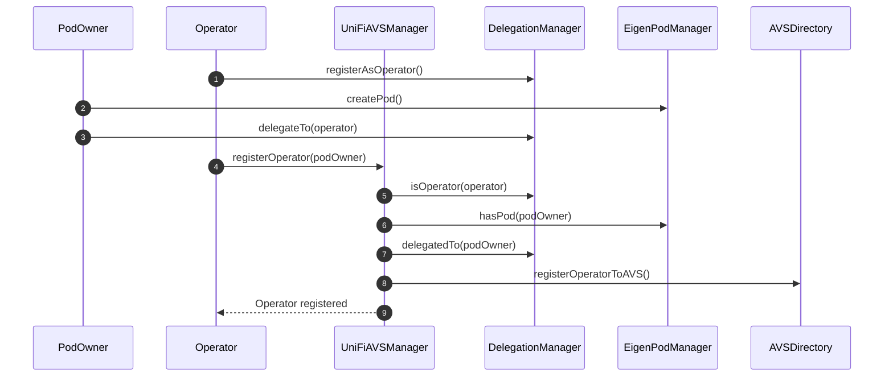
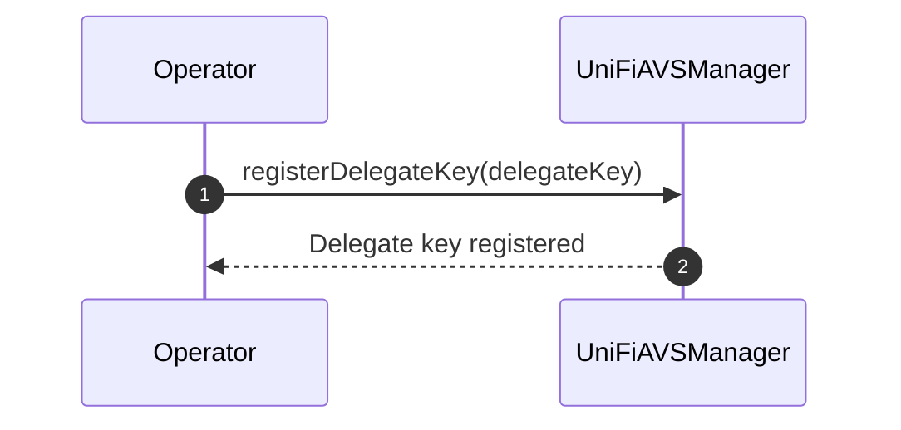

# Operator Registration Process

The following sequence diagram illustrates the process of an operator registering with the UniFi AVS manager.



## Registration Process Explanation
The registration process assumes that the `PodOwner` and the `Operator` mutually trust each other, i.e., are the same party. The reason for separating them is for more flexibility and compatibility with existing operators today.  

1. The `Operator` registers either an EOA or smart contract as an operator with the `DelegationManager`.
2. The `PodOwner` creates an EigenPod by calling `createPod()` on the `EigenPodManager`. They can then deploy validators and restake them.
3. The `PodOwner` delegates their stake to the `Operator` using the `delegateTo()` function in the `DelegationManager`.
4. The `Operator` calls `registerOperator()` on the `UniFiAVSManager`, supplying an ECDSA or EIP-1271 signature signaling their intent to opt-in to the AVS.
5. The `UniFiAVSManager` checks if the caller (`Operator`) is registered as an operator in the `DelegationManager`.
6. The `UniFiAVSManager` verifies that the `PodOwner` has created an EigenPod.
7. The `UniFiAVSManager` confirms that the `PodOwner` has delegated to the `Operator`.
8. If all checks pass, the `UniFiAVSManager` registers the operator with the global `AVSDirectory`. From the POV of EigenLayer, the `Operator` has officially joined the AVS.
9. The `Operator` is notified that the registration was successful.

This process ensures that only legitimate operators with delegated stake from EigenPod owners can register with the UniFi AVS manager.

### Delegate Key Registration

After the initial registration, the Operator needs to register a delegate key. This key will be used for signing pre-confirmations and other operations related to the UniFi AVS.



1. The `Operator` calls `registerDelegateKey()` on the `UniFiAVSManager`, providing the delegate key.
2. The `UniFiAVSManager` registers the delegate key for the Operator.
3. The `Operator` is notified that the delegate key registration was successful.

#### Key Type Flexibility

The type of key (e.g., ECDSA or BLS) is not specified in the registration process. This decision allows for flexibility in the future, accommodating different key types as needed without requiring changes to the core registration mechanism.

#### Single Key for All Validators

An important design decision is to use a single delegate key that applies to all of the Operator's registered validators. This approach comes with a trade-off:

**Advantages:**
- Significantly reduced gas costs for registration
- Lower storage costs on-chain
- Reduced complexity in key management

**Limitation:**
- Only one entity can be delegated to at once for all of an Operator's validators

This design choice prioritizes efficiency and simplicity. While it limits the granularity of delegation, it provides a streamlined experience for what will likely be the common case: delegating to a single Gateway.

### Validator Registration

Before any validators can be registered, the `UniFiAVSManager` contract performs a crucial check using the `podIsDelegated` modifier. This check demonstrates the mutual trust between the operator and the podOwner. Here's the code snippet for the modifier:

```solidity
modifier podIsDelegated(address podOwner) {
    if (!EIGEN_DELEGATION_MANAGER.isOperator(msg.sender)) {
        revert NotOperator();
    }
    if (!EIGEN_POD_MANAGER.hasPod(podOwner)) {
        revert NoEigenPod();
    }
    if (EIGEN_DELEGATION_MANAGER.delegatedTo(podOwner) != msg.sender) {
        revert NotDelegatedToOperator();
    }
    _;
}
```

This modifier ensures that:
1. The `Operator` (msg.sender) is a registered operator in the EigenLayer system.
2. The `podOwner` has an EigenPod.
3. The `podOwner` has delegated their stake to the `Operator`.

By delegating to the `Operator`, the `podOwner` is effectively giving permission for the `Operator` to set the delegate key. Since this key is used by the validator or in conjunction with their operations, it implies that the operator has some level of control over the validators in the EigenPod. This relationship underscores the importance of trust between the podOwner and the Operator.

After this check, the Operator can proceed to register the individual validators that will engage in pre-confs. 

The process for registering validators is illustrated in the following sequence diagram:


### Validator Registration Process Explanation

1. The `Operator` calls `registerValidators()` on the `UniFiAVSManager`, providing the `podOwner` address and an array of BLS public key hashes for the validators to be registered.

2. The `UniFiAVSManager` checks if the operator is registered with the AVS using the `AVSDirectory`.

3. The `UniFiAVSManager` verifies that the operator has set a delegate key.

4. For each BLS public key hash in the provided array:
   a. The `UniFiAVSManager` retrieves the validator information from the `EigenPod`.
   b. It checks if the validator is active in the EigenPod.
   c. It verifies that the validator is not already registered in the UniFi AVS.
   d. If all checks pass, it registers the validator, associating it with the operator and storing relevant information.

5. Once all validators are processed, the `UniFiAVSManager` confirms to the `Operator` that the validators have been registered.

This process ensures that only active, unregistered validators associated with the operator's EigenPod can be registered with the UniFi AVS. It maintains the integrity of the validator set and prevents duplicate registrations.
