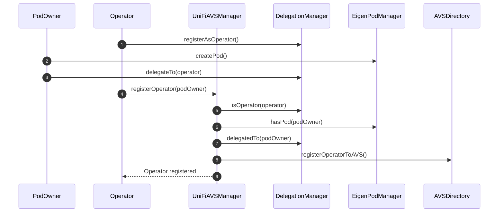
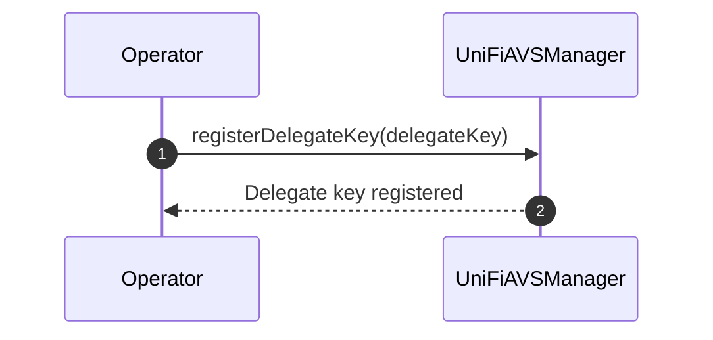

# Operator Registration Process

The following sequence diagram illustrates the process of an operator registering with the UniFi AVS manager.

## Registration Process Explanation
The registration process assumes that the `PodOwner` and the `Operator` mutually trust each other, i.e., are the same party. The reason for separating them is for more flexibility and compatibility with existing operators today.  

1. The `Operator` registers either an EOA or smart contract as an operator with the `DelegationManager`.
2. The `PodOwner` creates an EigenPod by calling `createPod()` on the `EigenPodManager`. They can then deploy validators and restake them.
3. The `PodOwner` delegates their stake to the `Operator` using the `delegateTo()` function in the `DelegationManager`.
4. The `Operator` calls `registerOperator()` on the `UniFiAVSManager`, supplying an ECDSA or EIP-1271 signature signaling their intent to opt-in to the AVS.
5. The `UniFiAVSManager` checks if the caller (`Operator`) is registered as an operator in the `DelegationManager`.
6. The `UniFiAVSManager` verifies that the `PodOwner` has created an EigenPod.
7. The `UniFiAVSManager` confirms that the `PodOwner` has delegated to the `Operator`.
8. If all checks pass, the `UniFiAVSManager` registers the operator with the global `AVSDirectory`. From the POV of EigenLayer, the `Operator` has officially joined the AVS.
9. The `Operator` is notified that the registration was successful.

This process ensures that only legitimate operators with delegated stake from EigenPod owners can register with the UniFi AVS manager.

### Delegate Key Registration

After the initial registration, the Operator needs to register a delegate key. This key will be used for signing pre-confirmations and other operations related to the UniFi AVS.

1. The `Operator` calls `registerDelegateKey()` on the `UniFiAVSManager`, providing the delegate key.
2. The `UniFiAVSManager` registers the delegate key for the Operator.
3. The `Operator` is notified that the delegate key registration was successful.

#### Key Type Flexibility

The type of key (e.g., ECDSA or BLS) is not specified in the registration process. This decision allows for flexibility in the future, accommodating different key types as needed without requiring changes to the core registration mechanism.

#### Single Key for All Validators

An important design decision is to use a single delegate key that applies to all of the Operator's registered validators. This approach comes with a trade-off:

**Advantages:**
- Significantly reduced gas costs for registration
- Lower storage costs on-chain
- Reduced complexity in key management and verification processes

**Limitation:**
- Only one entity can be delegated to at once for all of an Operator's validators

This design choice prioritizes efficiency and simplicity, which are crucial for a system that needs to operate at Ethereum's scale. While it limits the granularity of delegation, it provides a streamlined experience for most operators who manage their own validators or delegate to a single entity.

