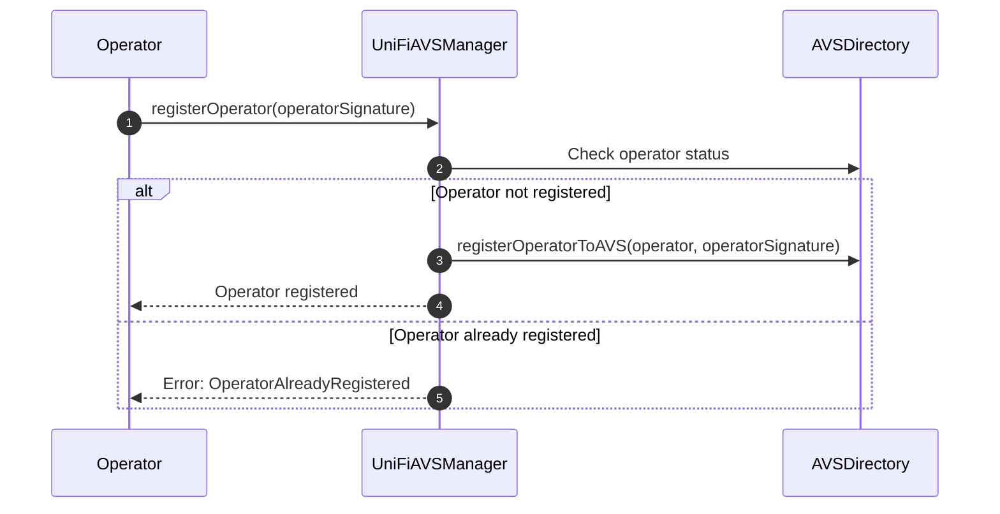
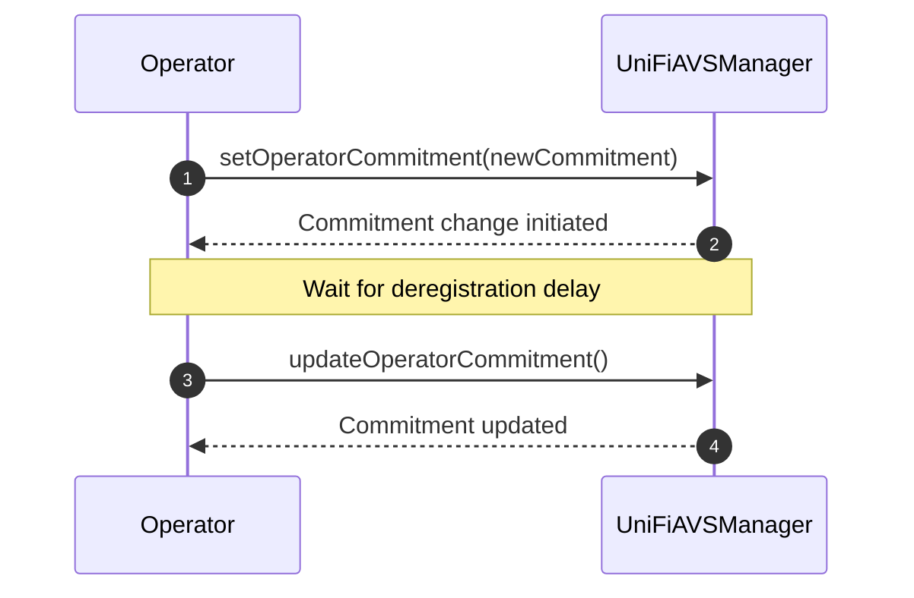
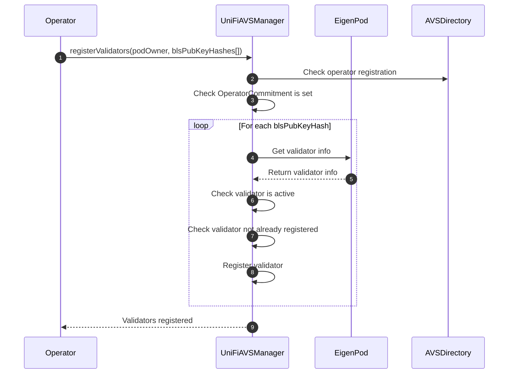
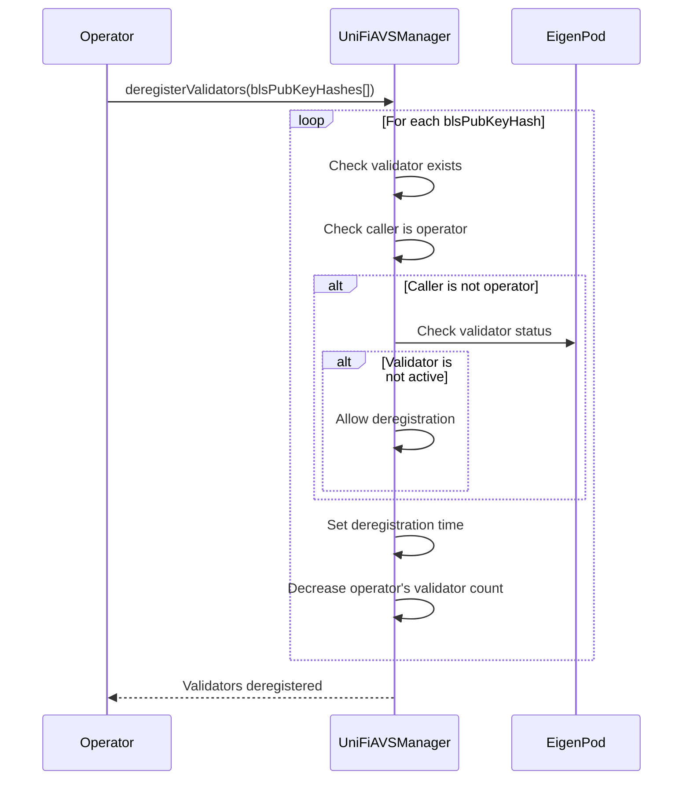
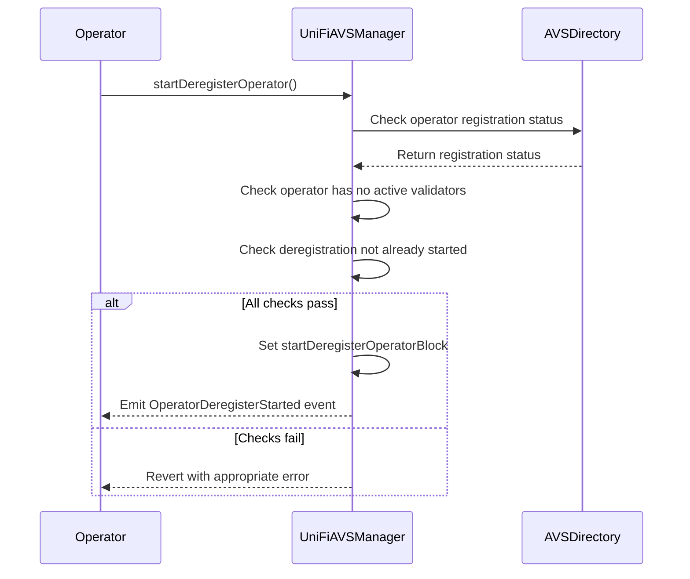
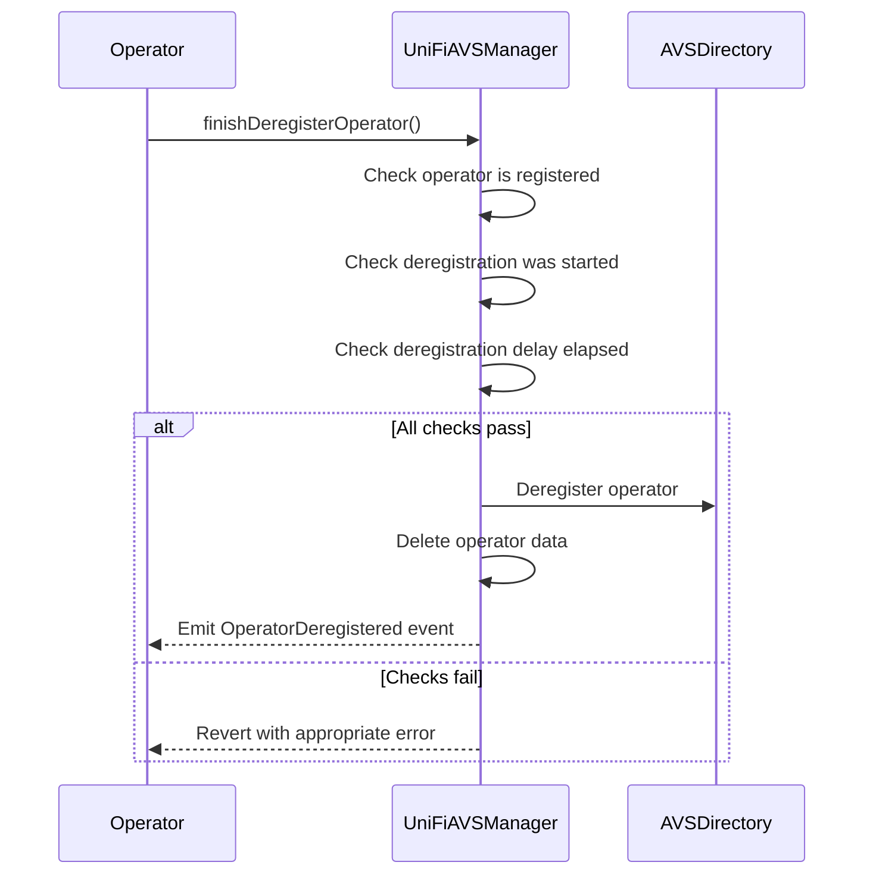

# Registering to UniFi AVS

## Registering an Operator

Step one to joining the AVS is to register an `Operator` in EigenLayer's `AVSDirectory`. It is assumed that the `Operator` is already known to the EigenLayer contracts, meaning they have previously registered as an operator at the `DelegationManager` contract. 

1. The `Operator` calls `registerOperator()` on the `UniFiAVSManager`, providing a signature (`operatorSignature`) that signals their intent to opt-in to the AVS.

2. The `UniFiAVSManager` checks the operator's status with the `AVSDirectory` to ensure they are not already registered to the AVS.

3. If the operator is not registered:
   - The `UniFiAVSManager` calls `registerOperatorToAVS()` on the `AVSDirectory`, passing the operator's address and signature.
   - The operator is successfully registered with the AVS.

4. If the operator is already registered:
   - The `UniFiAVSManager` reverts the transaction with an `OperatorAlreadyRegistered` error.

### Set a Preconf Commitment

After the initial registration, the Operator needs to set their `OperatorCommitment`, which consists of a delegate key and a set of rollup IDs. This commitment serves two purposes:

1. On-chain: It signals which chains the validator will accept preconfs for and the key they will use to sign off on them.
2. Off-chain: Other participants in the preconf ecosystem (such as rollups, gateways, or users) can use this information to determine which operators are available for preconfs on specific chains and how to verify their signatures.




1. The `Operator` calls `setOperatorCommitment()` on the `UniFiAVSManager`, providing the new commitment (delegate key and chain ID bitmap).
2. The `UniFiAVSManager` initiates the commitment change process, setting a future block number when the change can be finalized.
3. After the deregistration delay has passed, the `Operator` calls `updateOperatorCommitment()`.
4. The `UniFiAVSManager` updates the commitment for the Operator.

#### Commitment Update Process

The commitment change process involves a delay mechanism to ensure security and prevent rapid changes:

1. When `setOperatorCommitment()` is called:
   - The new commitment is stored as a pending change.
   - A block number is set for when the change can be finalized (current block + deregistration delay).

2. After the delay period, `updateOperatorCommitment()` can be called to finalize the change:
   - This function checks if the delay period has passed.
   - If so, it updates the commitment to the pending new commitment.
   - The pending commitment and validation block are then reset.

This two-step process with a delay prevents a malicious Operator from switching their commitment during the lookahead window. If they were to do so they could sign preconfs, and break promises by switching their key or supported chains without facing penalties.

#### Chain ID Bitmap

The `chainIDBitMap` is a 256-bit integer where each bit represents a specific chain ID. If a bit is set to 1, it means the Operator is committed to supporting that chain. This bitmap allows for efficient storage and quick checking of supported chains.

For example:
- If `chainIDBitMap` is 5 (binary: 101), the Operator supports chains with index 0 and 2.
- If `chainIDBitMap` is 7 (binary: 111), the Operator supports chains with index 0, 1, and 2.

The `UniFiAVSManager` contract provides a `bitmapToChainIDs` function to convert this bitmap into an array of 4-byte chain IDs, making it easy to retrieve the list of supported chains for any Operator. For example calling `bitmapToChainIDs(0b101)` may return two stored chainIDs `[0x11111111, 0x22222222]`.

#### Key Type
The type of key (e.g., ECDSA or BLS) is not specified in the registration process. This decision allows for flexibility in the future, accommodating different key types as needed without requiring changes to the core registration mechanism.

#### Number of Delegate Keys
An important design decision is to use a single delegate key that applies to all of the Operator's registered validators. This approach comes with a trade-off:

**Advantages:**
- Significantly reduced gas costs for registration
- Lower storage costs on-chain
- Reduced complexity in key management

**Limitation:**
- Only one entity can be delegated to at once for all of an Operators' validators

This design choice prioritizes efficiency and simplicity. While it limits the granularity of delegation, it provides a streamlined experience for what will likely be the common case: delegating to a single Gateway.

### Validator Registration
Validator registration is essential in the UniFi AVS because preconfs fall under the umbrella proposer commitments, requiring participation from Ethereum validators. In the context of EigenLayer, this means we need the Operator to register validators that have been deployed in EigenPods and are natively restaked. 

Before the Operator can register any validators, the `UniFiAVSManager` contract performs a check using the `podIsDelegated` modifier. This check demonstrates the mutual trust between the operator and the EigenPod owner (podOwner):

```solidity
modifier podIsDelegated(address podOwner) {
    if (!EIGEN_DELEGATION_MANAGER.isOperator(msg.sender)) {
        revert NotOperator();
    }
    if (!EIGEN_POD_MANAGER.hasPod(podOwner)) {
        revert NoEigenPod();
    }
    if (EIGEN_DELEGATION_MANAGER.delegatedTo(podOwner) != msg.sender) {
        revert NotDelegatedToOperator();
    }
    _;
}
```

This modifier ensures that:
1. The `Operator` (msg.sender) is a registered operator in EigenLayer's system.
2. The `podOwner` has an EigenPod.
3. The `podOwner` has delegated their stake to the `Operator`.

By delegating to the `Operator`, the `podOwner` is effectively giving permission for the `Operator` to register validators associated with their EigenPod. This relationship underscores the importance of trust between the podOwner and the Operator.

After this check, the Operator can proceed to register the individual validators that will engage in pre-confs:



### Validator Registration Process Explanation

1. The `Operator` calls `registerValidators()` on the `UniFiAVSManager`, providing the `podOwner` address and an array of BLS public key hashes for the validators to be registered.

2. The `UniFiAVSManager` checks if the operator is registered with the AVS using the `AVSDirectory`.

3. The `UniFiAVSManager` verifies that the operator has set an OperatorCommitment.

4. For each BLS public key hash in provided:
    - The `UniFiAVSManager` retrieves the validator information from the `EigenPod`.
    - It checks if the validator is active in the EigenPod.
    - It verifies that the validator is not already registered in the UniFi AVS.
    - If all checks pass, it registers the validator, associating it with the operator and storing relevant information.

5. The `UniFiAVSManager` updates the operator's validator count and resets their deregistration state if they had previously queued to deregister their operator.

These checks will ensure that a validator can only be registered exactly once in the AVS, and that it can only be to the Operator whom the validator's podOwner is delegated to.


# Deregistering from UniFi AVS

## Deregistering Validators

Deregistering validators is the first step in the process of deregistering an operator from the UniFi AVS. An operator must deregister all validators they previously added during the `registerValidators()` step before they can proceed with deregistering themselves.



1. Operator calls `deregisterValidators()` with BLS public key hashes.
2. For each validator:
   - Check if validator exists
   - If caller is operator, proceed
   - If not, check if validator is inactive in EigenPod (allows non-operators to remove inactive validators)
   - Set deregistration time to `current block + deregistrationDelay`
   - Decrease operator's validator count
3. Emit `ValidatorDeregistered` event for each validator

Important notes:
- When `deregisterValidators()` is called, the validators remain active for `deregistrationDelay` blocks. During this delay period, validators are still liable for penalties and are expected to perform their duties.

## Deregistering Operators
After deregistering all validators, an operator can initiate their own deregistration from the UniFi AVS. This process also involves a delay to ensure a smooth transition.

The operator deregistration process consists of two steps:


#### Start Deregistration:

   - Operator calls `startDeregisterOperator()`
   - UniFiAVSManager checks:
     - Operator is registered
     - Operator has no active validators
     - Deregistration hasn't already been started
   - If checks pass, sets `startDeregisterOperatorBlock` to current block number
   - Emits `OperatorDeregisterStarted` event


#### Finish Deregistration:

   - After the deregistration delay period, operator calls `finishDeregisterOperator()`
   - UniFiAVSManager checks:
     - Operator is registered
     - Deregistration was started (startDeregisterOperatorBlock != 0)
     - Deregistration delay period has elapsed
   - If checks pass:
     - Calls AVS Directory to deregister operator
     - Deletes operator data from UniFiAVSManager
     - Emits `OperatorDeregistered` event

Important notes:
- During the delay period, the operator is still considered active and may be liable for penalties.
- Once deregistration is complete, the operator will no longer be able to participate in the UniFi AVS without re-registering.
