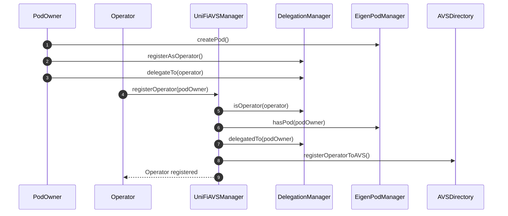

# Operator Registration Process

The following sequence diagram illustrates the process of an operator registering with the UniFi AVS manager.

## Registration Process Explanation

1. The `PodOwner` creates an EigenPod by calling `createPod()` on the `EigenPodManager`.
2. The `PodOwner` registers as an operator with the `DelegationManager`.
3. The `PodOwner` delegates their stake to the `Operator` using the `delegateTo()` function in the `DelegationManager`.
4. The `Operator` calls `registerOperator()` on the `UniFiAVSManager`, providing the address of the `PodOwner`.
5. The `UniFiAVSManager` checks if the caller (Operator) is registered as an operator in the `DelegationManager`.
6. The `UniFiAVSManager` verifies that the `PodOwner` has created an EigenPod.
7. The `UniFiAVSManager` confirms that the `PodOwner` has delegated to the `Operator`.
8. If all checks pass, the `UniFiAVSManager` registers the operator with the global `AVSDirectory`.
9. The `Operator` is notified that the registration was successful.

This process ensures that only legitimate operators with delegated stake from EigenPod owners can register with the UniFi AVS manager.
