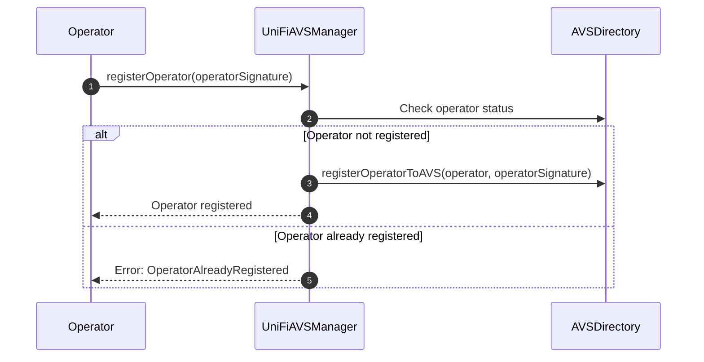
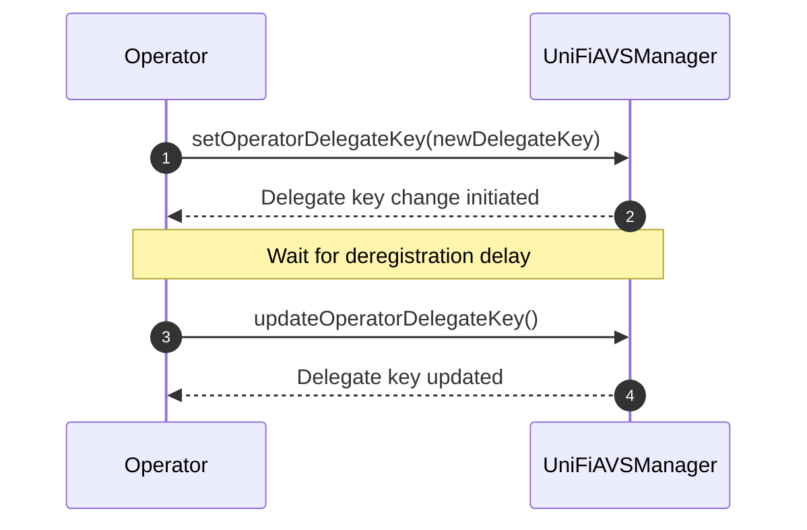

# Operator Registration Process

The following sequence diagram illustrates the process of an operator registering with the UniFi AVS manager.



## Operator Registration Process
The registration process is simplified compared to the previous version, focusing on the interaction between the Operator, UniFiAVSManager, and AVSDirectory.

1. The `Operator` calls `registerOperator()` on the `UniFiAVSManager`, providing a signature (`operatorSignature`) that signals their intent to opt-in to the AVS.

2. The `UniFiAVSManager` checks the operator's status with the `AVSDirectory` to ensure they are not already registered.

3. If the operator is not registered:
   - The `UniFiAVSManager` calls `registerOperatorToAVS()` on the `AVSDirectory`, passing the operator's address and signature.
   - The operator is successfully registered with the AVS.

4. If the operator is already registered:
   - The `UniFiAVSManager` reverts the transaction with an `OperatorAlreadyRegistered` error.

This streamlined process ensures that operators can register directly with the UniFi AVS manager, which then handles the interaction with the AVSDirectory. The process is more straightforward and aligns with the actual implementation in the `UniFiAVSManager` contract.

Note: The previous steps involving the PodOwner, EigenPodManager, and DelegationManager are not part of the direct registration process in the `UniFiAVSManager` contract. These steps may be prerequisites handled separately before an operator attempts to register with the UniFi AVS.

### Delegate Key Registration

After the initial registration, the Operator needs to set a delegate key. This key will be used for signing pre-confirmations and other operations related to the UniFi AVS. The process involves two steps: initiating the change and then updating the key after a delay.



1. The `Operator` calls `setOperatorDelegateKey()` on the `UniFiAVSManager`, providing the new delegate key.
2. The `UniFiAVSManager` initiates the delegate key change process, setting a future block number when the change can be finalized.
3. After the deregistration delay has passed, the `Operator` calls `updateOperatorDelegateKey()`.
4. The `UniFiAVSManager` updates the delegate key for the Operator.

#### Key Rotation Process

The delegate key change process involves a delay mechanism to ensure security and prevent rapid changes:

1. When `setOperatorDelegateKey()` is called:
   - The new key is stored as a pending change.
   - A block number is set for when the change can be finalized (current block + deregistration delay).

2. After the delay period, `updateOperatorDelegateKey()` can be called to finalize the change:
   - This function checks if the delay period has passed.
   - If so, it updates the delegate key to the pending new key.
   - The pending key and validation block are then reset.

This two-step process with a delay prevents a malicious Operator from switching their delegateKey during the lookahead window. If they were to do so they could sign preconfs, and break promises by switching their key without facing penalities.

#### Key Type Flexibility

The type of key (e.g., ECDSA or BLS) is not specified in the registration process. This decision allows for flexibility in the future, accommodating different key types as needed without requiring changes to the core registration mechanism.

#### Single Key for All Validators

An important design decision is to use a single delegate key that applies to all of the Operator's registered validators. This approach comes with a trade-off:

**Advantages:**
- Significantly reduced gas costs for registration
- Lower storage costs on-chain
- Reduced complexity in key management

**Limitation:**
- Only one entity can be delegated to at once for all of an Operator's validators

This design choice prioritizes efficiency and simplicity. While it limits the granularity of delegation, it provides a streamlined experience for what will likely be the common case: delegating to a single Gateway.

### Validator Registration

Before any validators can be registered, the `UniFiAVSManager` contract performs a crucial check using the `podIsDelegated` modifier. This check demonstrates the mutual trust between the operator and the podOwner:

```solidity
modifier podIsDelegated(address podOwner) {
    if (!EIGEN_DELEGATION_MANAGER.isOperator(msg.sender)) {
        revert NotOperator();
    }
    if (!EIGEN_POD_MANAGER.hasPod(podOwner)) {
        revert NoEigenPod();
    }
    if (EIGEN_DELEGATION_MANAGER.delegatedTo(podOwner) != msg.sender) {
        revert NotDelegatedToOperator();
    }
    _;
}
```

This modifier ensures that:
1. The `Operator` (msg.sender) is a registered operator in EigenLayer's system.
2. The `podOwner` has an EigenPod.
3. The `podOwner` has delegated their stake to the `Operator`.

By delegating to the `Operator`, the `podOwner` is effectively giving permission for the `Operator` to register validators associated with their EigenPod. This relationship underscores the importance of trust between the podOwner and the Operator.

After this check, the Operator can proceed to register the individual validators that will engage in pre-confs. 

The process for registering validators is illustrated in the following sequence diagram:


### Validator Registration Process Explanation

1. The `Operator` calls `registerValidators()` on the `UniFiAVSManager`, providing the `podOwner` address and an array of BLS public key hashes for the validators to be registered.

2. The `UniFiAVSManager` checks if the operator is registered with the AVS using the `AVSDirectory`.

3. The `UniFiAVSManager` verifies that the operator has set a delegate key.

4. For each BLS public key hash in the provided array:
    - The `UniFiAVSManager` retrieves the validator information from the `EigenPod`.
    - It checks if the validator is active in the EigenPod.
    - It verifies that the validator is not already registered in the UniFi AVS.
    - If all checks pass, it registers the validator, associating it with the operator and storing relevant information.

5. The `UniFiAVSManager` updates the operator's validator count and resets their deregistration state if they had previously queued to deregister their operator.