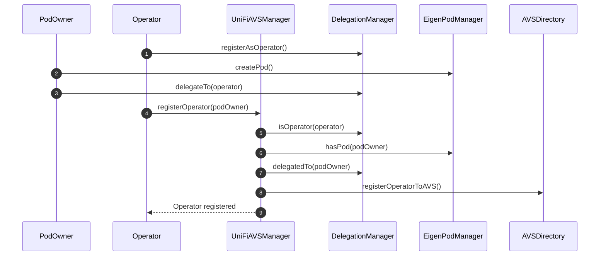

# Operator Registration Process

The following sequence diagram illustrates the process of an operator registering with the UniFi AVS manager.

## Registration Process Explanation
The registration process assumes that the `PodOwner` and the `Operator` mutually trust each other, i.e., are the same party. The reason for separating them is for more flexibility and compatibility with existing operators today.  

1. The `Operator` registers either an EOA or smart contract as an operator with the `DelegationManager`.
2. The `PodOwner` creates an EigenPod by calling `createPod()` on the `EigenPodManager`. They can then deploy validators and restake them.
3. The `PodOwner` delegates their stake to the `Operator` using the `delegateTo()` function in the `DelegationManager`.
4. The `Operator` calls `registerOperator()` on the `UniFiAVSManager`, supplying an ECDSA or EIP-1271 signature signaling their intent to opt-in to the AVS.
5. The `UniFiAVSManager` checks if the caller (`Operator`) is registered as an operator in the `DelegationManager`.
6. The `UniFiAVSManager` verifies that the `PodOwner` has created an EigenPod.
7. The `UniFiAVSManager` confirms that the `PodOwner` has delegated to the `Operator`.
8. If all checks pass, the `UniFiAVSManager` registers the operator with the global `AVSDirectory`. From the POV of EigenLayer, the `Operator` has officially joined the AVS.
9. The `Operator` is notified that the registration was successful.

This process ensures that only legitimate operators with delegated stake from EigenPod owners can register with the UniFi AVS manager.

