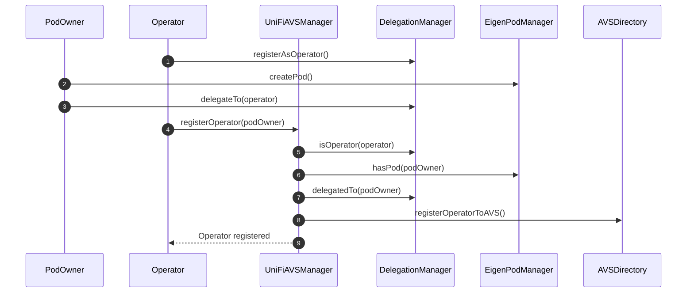
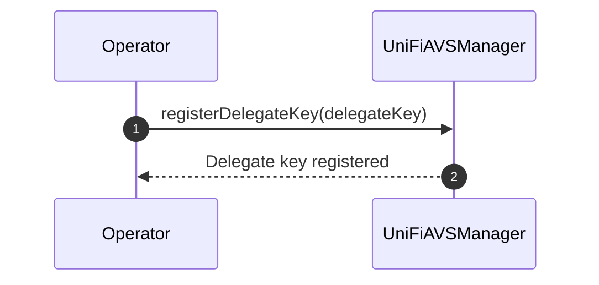
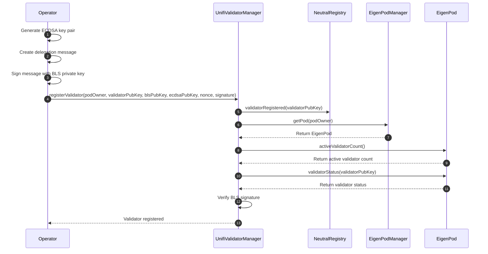

# Operator Registration Process

The following sequence diagram illustrates the process of an operator registering with the UniFi AVS manager.



## Registration Process Explanation
The registration process assumes that the `PodOwner` and the `Operator` mutually trust each other, i.e., are the same party. The reason for separating them is for more flexibility and compatibility with existing operators today.  

1. The `Operator` registers either an EOA or smart contract as an operator with the `DelegationManager`.
2. The `PodOwner` creates an EigenPod by calling `createPod()` on the `EigenPodManager`. They can then deploy validators and restake them.
3. The `PodOwner` delegates their stake to the `Operator` using the `delegateTo()` function in the `DelegationManager`.
4. The `Operator` calls `registerOperator()` on the `UniFiAVSManager`, supplying an ECDSA or EIP-1271 signature signaling their intent to opt-in to the AVS.
5. The `UniFiAVSManager` checks if the caller (`Operator`) is registered as an operator in the `DelegationManager`.
6. The `UniFiAVSManager` verifies that the `PodOwner` has created an EigenPod.
7. The `UniFiAVSManager` confirms that the `PodOwner` has delegated to the `Operator`.
8. If all checks pass, the `UniFiAVSManager` registers the operator with the global `AVSDirectory`. From the POV of EigenLayer, the `Operator` has officially joined the AVS.
9. The `Operator` is notified that the registration was successful.

This process ensures that only legitimate operators with delegated stake from EigenPod owners can register with the UniFi AVS manager.

### Delegate Key Registration

After the initial registration, the Operator needs to register a delegate key. This key will be used for signing pre-confirmations and other operations related to the UniFi AVS.



1. The `Operator` calls `registerDelegateKey()` on the `UniFiAVSManager`, providing the delegate key.
2. The `UniFiAVSManager` registers the delegate key for the Operator.
3. The `Operator` is notified that the delegate key registration was successful.

#### Key Type Flexibility

The type of key (e.g., ECDSA or BLS) is not specified in the registration process. This decision allows for flexibility in the future, accommodating different key types as needed without requiring changes to the core registration mechanism.

#### Single Key for All Validators

An important design decision is to use a single delegate key that applies to all of the Operator's registered validators. This approach comes with a trade-off:

**Advantages:**
- Significantly reduced gas costs for registration
- Lower storage costs on-chain
- Reduced complexity in key management

**Limitation:**
- Only one entity can be delegated to at once for all of an Operator's validators

This design choice prioritizes efficiency and simplicity. While it limits the granularity of delegation, it provides a streamlined experience for what will likely be the common case: delegating to a single Gateway.

### Validator Registration

Before any validators can be registered, the `UniFiAVSManager` contract performs a crucial check using the `podIsDelegated` modifier. This check demonstrates the mutual trust between the operator and the podOwner. Here's the code snippet for the modifier:

```solidity
modifier podIsDelegated(address podOwner) {
    if (!EIGEN_DELEGATION_MANAGER.isOperator(msg.sender)) {
        revert NotOperator();
    }
    if (!EIGEN_POD_MANAGER.hasPod(podOwner)) {
        revert NoEigenPod();
    }
    if (EIGEN_DELEGATION_MANAGER.delegatedTo(podOwner) != msg.sender) {
        revert NotDelegatedToOperator();
    }
    _;
}
```

This modifier ensures that:
1. The caller (msg.sender) is a registered operator in the EigenLayer system.
2. The podOwner has an EigenPod.
3. The podOwner has delegated their stake to the operator (msg.sender).

By delegating to the Operator, the podOwner is effectively giving permission for the Operator to set the delegate key. Since this key is used by the validator or in conjunction with their operations, it implies that the operator has some level of control over the validators in the EigenPod. This relationship underscores the importance of trust between the podOwner and the Operator in the UniFi AVS system.

After this check, the Operator can proceed to register their individual validators that will engage in pre-confs. This process involves delegating pre-confirmation rights from a validator's BLS key to an ECDSA key, which will be used for signing pre-confirmations.

> **Aside on Neutrality**: In the spirit of neutrality, it is important to keep pre-conf registrations credibly neutral. As such, the Ethereum Foundation is working to launch a permissionless registry contract that exists outside of any protocols (i.e., outside of Puffer or EigenLayer). To prevent fragmentation, the UniFi AVS registry contract will look to this registry as a primary source when validators register. Once the neutral registry contract is available, an additional check can be added.

The validator registration process consists of the following steps:

1. **Key Generation**: The validator generates an ECDSA key pair for signing pre-confirmations.

2. **Message Creation**: The validator creates a message containing:
   - The validator's public key (BLS)
   - The ECDSA public key to which pre-conf rights are being delegated
   - A nonce or timestamp to prevent replay attacks

3. **Message Signing**: The validator signs this message using their BLS private key.

4. **Registration Submission**: The signed message is submitted to the `UnifiValidatorManager` contract.



The on-chain registration process ensures that only the rightful owner of the `EigenPod` and therefore the validator can delegate pre-confirmation rights. The `registerValidator` function in the `UnifiValidatorManager` contract performs several checks:

1. Verifies that the validator is registered in the neutral registry.
2. Confirms that the validator exists in EigenLayer and is active.
3. Validates the BLS signature to ensure the delegation is authorized.

This process allows for a secure and verifiable registration of validators, maintaining the integrity of the UniFi AVS pre-confirmation system.

